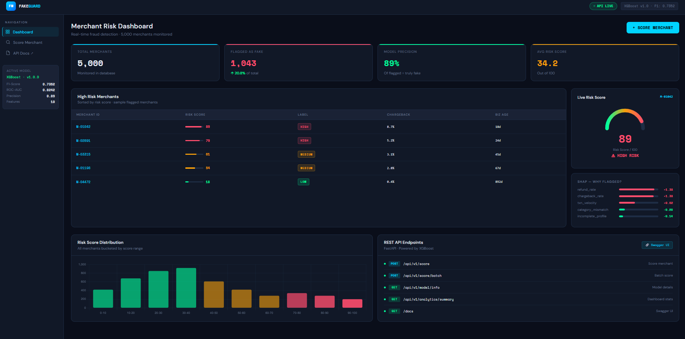
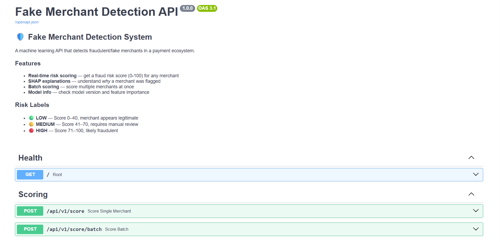
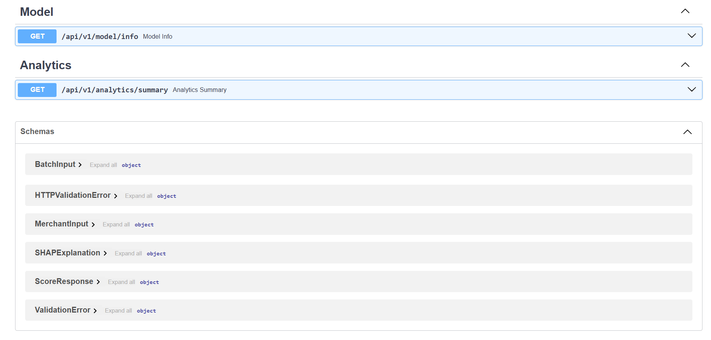

# 🛡️ FakeGuard — Fake Merchant Detection System

A machine learning-powered fraud detection system that identifies fake/fraudulent merchants in a payment ecosystem using XGBoost, SHAP explainability, and a FastAPI REST backend.



---

## 🚀 Live Demo

> Run locally — see setup instructions below

---

## ✨ Features

- **Real-time risk scoring** — score any merchant and get a fraud risk score (0–100)
- **SHAP explainability** — understand *why* a merchant was flagged
- **REST API** — FastAPI backend with auto-generated Swagger docs
- **Interactive dashboard** — dark-themed UI with live scoring form
- **Batch scoring** — score multiple merchants in one API call

---

## 🧠 How It Works

1. **Synthetic data** — 5,000 merchant records generated with realistic fraud patterns
2. **Feature engineering** — 10 behavioral features like chargeback rate, business age, night transaction ratio
3. **XGBoost model** — trained on labeled data to classify merchants as legitimate or fraudulent
4. **SHAP explainer** — explains top contributing features for every prediction
5. **FastAPI** — serves the model as a REST API with Pydantic validation

---

## 📊 Model Performance

| Metric | Score |
|---|---|
| F1-Score | 0.7352 |
| ROC-AUC | 0.8242 |
| Precision | 0.89 |
| Accuracy | 0.88 |

---

## 🔍 Features Used

| Feature | Description | Fraud Signal |
|---|---|---|
| transaction_velocity | Avg daily transaction count | Very high = suspicious |
| refund_rate | Refunds / total transactions | > 15% suspicious |
| chargeback_rate | Chargebacks / total transactions | > 2% high risk |
| business_age_days | Days since merchant registration | < 30 days risky |
| category_mismatch_score | Txn category vs registered MCC | High = mismatch |
| night_txn_ratio | % transactions between 11PM–5AM | High ratio suspect |
| unique_customer_ratio | Unique customers / total txns | Very high = fake |
| geographic_spread | Unique cities in transactions | Unusual spread |
| incomplete_profile_score | Missing business info fields | High = fake |
| avg_transaction_value | Mean transaction amount (INR) | Extreme values flag |

---

## 🛠️ Tech Stack

| Layer | Technology |
|---|---|
| ML Model | XGBoost |
| Explainability | SHAP |
| Data Processing | pandas, numpy, scikit-learn |
| Class Imbalance | SMOTE (imbalanced-learn) |
| API Framework | FastAPI + uvicorn |
| Data Validation | Pydantic |
| Frontend | HTML, CSS, JavaScript, Chart.js |
| Model Storage | joblib (.pkl files) |

---

## 📁 Project Structure

```
fake-merchant-detection/
├── data/
│   ├── generate_data.py        # Synthetic dataset generator
│   └── merchants_dataset.csv   # Generated training data
├── ml/
│   ├── train.py                # Model training pipeline
│   └── models/
│       ├── merchant_detector.pkl
│       ├── scaler.pkl
│       ├── shap_explainer.pkl
│       ├── confusion_matrix.png
│       ├── feature_importance.png
│       └── shap_summary.png
├── api/
│   ├── __init__.py
│   └── main.py                 # FastAPI application
├── screenshots/
│   ├── dashboard.png
│   └── swagger.png
├── index.html                  # Dashboard UI
└── README.md
```

---

## ⚙️ Setup & Run

### 1. Clone the repository
```bash
git clone https://github.com/akshu0806/fake-merchant-detection.git
cd fake-merchant-detection
```

### 2. Create virtual environment
```bash
python -m venv venv
venv\Scripts\activate  # Windows
```

### 3. Install dependencies
```bash
pip install pandas numpy scikit-learn xgboost shap matplotlib seaborn imbalanced-learn fastapi uvicorn pydantic
```

### 4. Generate data & train model
```bash
cd data && python generate_data.py && cd ..
python ml/train.py
```

### 5. Start the API
```bash
uvicorn api.main:app --reload
```

### 6. Open the dashboard
Open `index.html` in your browser.

API docs available at: `http://127.0.0.1:8000/docs`

---

## 📡 API Endpoints

| Method | Endpoint | Description |
|---|---|---|
| POST | `/api/v1/score` | Score a single merchant |
| POST | `/api/v1/score/batch` | Score multiple merchants |
| GET | `/api/v1/model/info` | Model details & feature importance |
| GET | `/api/v1/analytics/summary` | Dashboard statistics |
| GET | `/docs` | Swagger UI |

### Example Request
```bash
curl -X POST http://127.0.0.1:8000/api/v1/score \
  -H "Content-Type: application/json" \
  -d '{
    "merchant_id": "M-99001",
    "transaction_velocity": 245,
    "avg_transaction_value": 12500,
    "refund_rate": 0.21,
    "chargeback_rate": 0.087,
    "business_age_days": 18,
    "category_mismatch_score": 0.72,
    "night_txn_ratio": 0.38,
    "unique_customer_ratio": 0.95,
    "geographic_spread": 18,
    "incomplete_profile_score": 0.72
  }'
```

### Example Response
```json
{
  "merchant_id": "M-99001",
  "risk_score": 89,
  "risk_label": "HIGH",
  "fraud_probability": 0.8898,
  "shap_explanations": [
    { "feature": "refund_rate", "impact": 1.3753, "value": 0.21 },
    { "feature": "chargeback_rate", "impact": 1.3752, "value": 0.087 },
    { "feature": "transaction_velocity", "impact": 0.6162, "value": 245.0 }
  ],
  "message": "Merchant flagged as high risk. Immediate review recommended."
}
```

---

## 📸 Screenshots

### Swagger API Docs



---

## 🎯 Key Design Decisions

- **XGBoost over neural networks** — better interpretability for fintech compliance, faster training on tabular data
- **SHAP explainability** — every prediction comes with a reason, critical for regulatory audits
- **Precision over recall** — minimizes false flags on legitimate merchants (89% precision)
- **Synthetic data** — real fraud datasets are not publicly available; distributions derived from industry research

---

## 👤 Author

**Akshitha Sivakumar** — 2nd Year AIDS Student  
Built as a fintech portfolio project to demonstrate ML system design skills.
